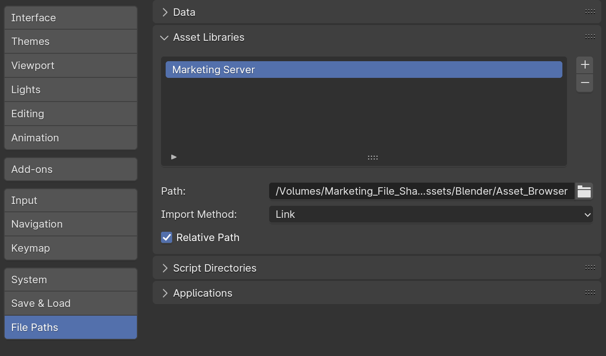

---
hide:
  - toc
---

# **Asset Browser**

!!! note
    Anything that can be reused across projects, such as Materials, Lighting Setups, Props, etc., can be marked as an Asset.

## **Setting up an Asset Library**

1. Open Blender Preferences (**Edit > Preferences…**)
1. Locate **File Paths > Asset Libraries**
1. Click the ++plus++ to add a new Asset Library
1. Browse to specific location
    - i.e. *Marketing_File_Share/Render_Assets/Blender/Asset_Browser*
1. Click ***Add Asset Library***
1. Label the Asset Library
    - i.e. *Marketing Server*
1. Set Import Method: ***Append (Reuse Data)*** or ***Link***
    - **Link** is useful if the asset will *NOT* need to be changed.
    - **Append** is useful for assets that may need to be moved or edited once placed.
1. Save Preferences!

<figure markdown="span">
  { width="600" }
</figure>

!!! note
    Saving .blend files in this folder will add anything marked as an asset to your Asset Browser.

    *It’s best to ONLY place finalized assets on the Marketing Server.*

---

!!! warning
    Renaming, Moving, or Deleting assets used in other .blend files will throw an error when re-opening that .blend file.

---

## **Linked Assets**

- Objects Marked as Asset:
    - CAN change materials
    - CANNOT move from default position
- Collections Marked as Asset:
    - CAN move from default position
    - CANNOT change materials

**If the asset will need to be moved / translated in another scene:**

- Move all objects to **Collection**
- Mark the **Collection** as asset, NOT just the object(s)

---

## **Creating New Metal Material** (Example)

1. Open “Materials.blend” in “…/Asset_Browser”
1. Create / Edit Material
1. ++right-button++ click Material > ***Mark as Asset***
1. In Asset Browser window > Current File > Drag New Asset from ***Unassigned*** to proper ***Catalog***
1. Save .blend file!
1. Open .blend file that needs new Material (i.e. “Beauty_Render-Ready_CAD.blend”)
1. Assign new Metal Material Asset to CAD geometry
1. Save .blend file!

---

## **Adding Models from Another .blend File**

1. Select ***Scene Collection*** in Outliner
1. File > Append…
1. Double-click .blend file with model
1. Click **Collection** > Parent Collection
1. Assign Materials
1. ++right-button++ click Collection > **Mark as Asset**
1. In Asset Browser window > Current File > Drag New Asset from “Unassigned” to proper “Catalog”
1. Save .blend file!

---

## **Use “Worlds” in Asset Browser for Render Setups**

- Display Mode > Blender File > Worlds
- Store HDRIs
- Save .blend file IN Asset folder
- **Append (Reuse Data)** or **Link**
    - Use **Append** for Lights or any other assets that need may need to be edited individually
    - **Link** is useful if the lighting is locked in and will NOT need to be changed

---
