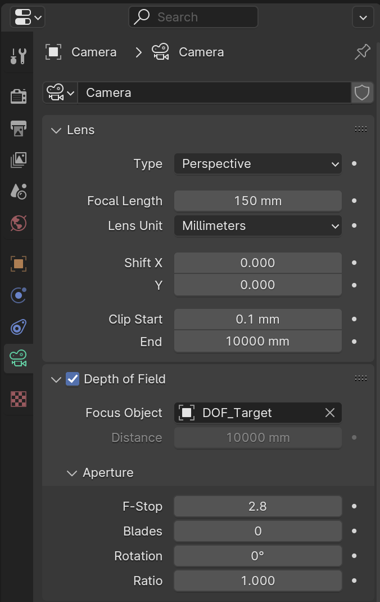
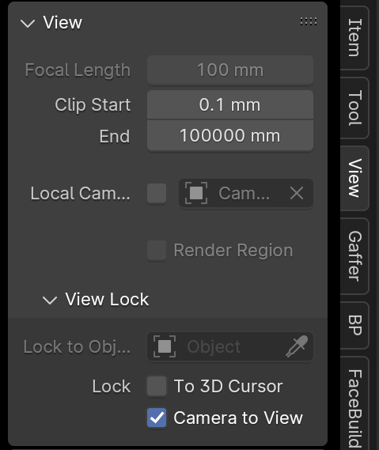
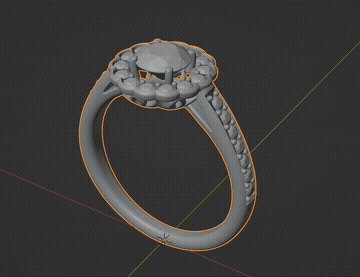
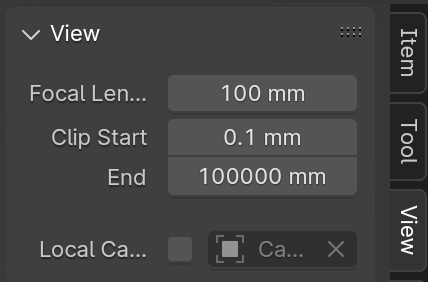
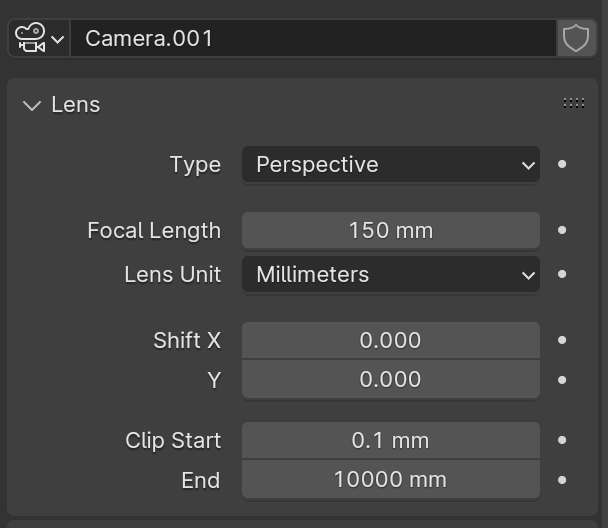

# **Cameras**

{==

The **Master** .blend file already contains a camera that can be used as a starting point for most scenes.

==}

## **Main Settings**

- Select the camera and click on the camera icon in the Object Data Properties panel

### **Lens**
- **Focal Length** : 100-200 mm (for most beauty shots)

### **Depth of Field**
- **Focus Object** : set to “Empty” object that can be positioned as needed in viewport
- **F-Stop** : ***Adjust as needed*** (if needed for scene)
    - Higher Values = Sharper Image
- **Blades** : ***8***
- **Rotation** : ***0***
- **Ratio** : ***2.0***

{ width="320", align=right }

---

## **Positioning the Camera**

- Press ++0++ while in the viewport to toggle the view to look through the active camera.
- Change the camera view using basic viewport navigation
    - **Rotate Viewport** - Click & Drag with ++middle-button++
    - **Track / Pan Viewport** - While holding ++shift++ key, Click & Drag with ++middle-button++
    - **Zoom Viewport** - While holding ++ctrl++ key, Click & Drag with ++middle-button++

!!! note
    Must Enable “Camera to View” in the View tab.
    
    Open the Sidebar (menu) by pressing the **N** key and select the View Tab

<figure markdown="span">
  { width="256" }
  <figcaption>View tab</figcaption>
</figure>

- Select an object to pivot the camera’s view around that object (optional)

---

## **Viewport Clipping**

- Sometimes when zooming too close (or too far) to an object, the geometry gets ***clipped***.
- Fix this by adjusting **Clip Start** and **End** in the **View** tab or **Camera Settings**.

<figure markdown="span">
  { width="400" }
  <figcaption>“Clipped” geometry in the viewport</figcaption>
</figure>

<figure markdown="span">
  { width="256" }
  <figcaption>View tab</figcaption>
</figure>

<figure markdown="span">
  { width="256" }
  <figcaption>Camera Settings</figcaption>
</figure>

---
