# **Getting Started with Blender**

- When first launching Blender, you will see the splash screen:

<figure markdown="span">
  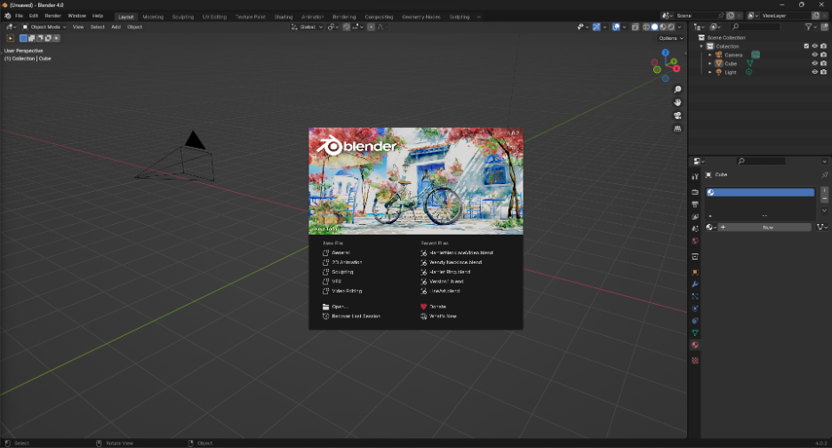{ width="720" }
  <figcaption>From here you can create a new file, open an existing file, and see files that you recently worked on.</figcaption>
</figure>

- You can dismiss this splash screen by clicking anywhere in the viewport.

- You can also disable the splash screen completely by going to **Edit > Preferences…**

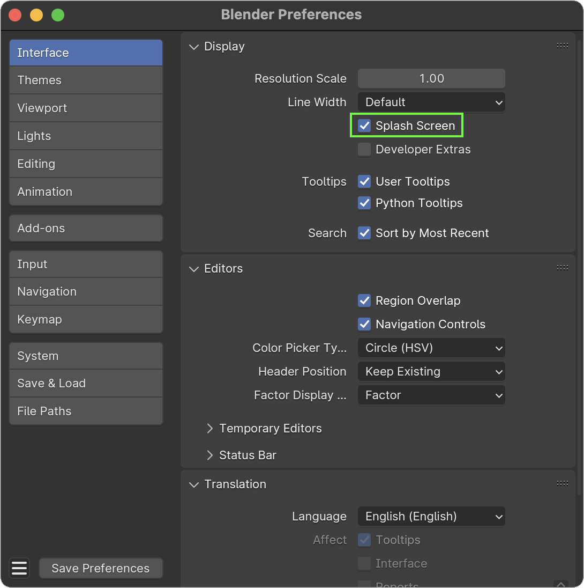{ width="420", align=right }

---

## **Default Scene**

- This is the main Blender view that you will see most of the time. 
- The area boxed in pink is the viewport, the area in green is the outliner where you can see a list of all objects in the scene, and the area in blue is the properties tab.

<figure markdown="span">
  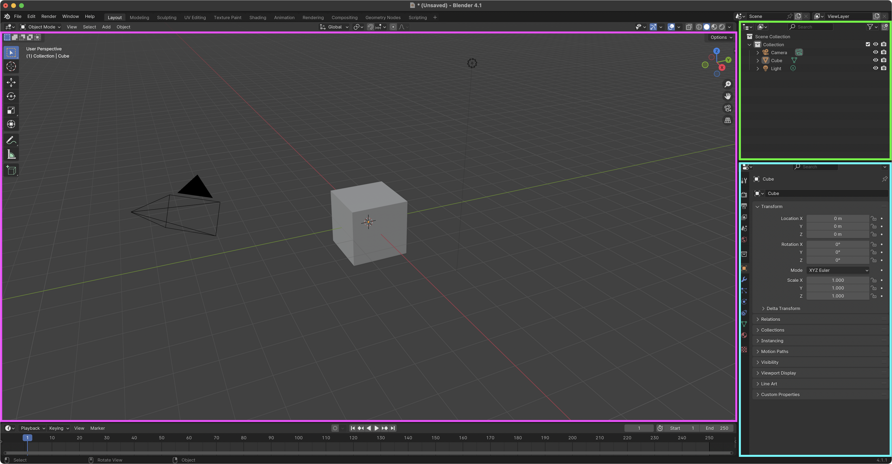{ width="720" }
  <figcaption>By default, the scene includes a cube, a camera, and a single light.</figcaption>
</figure>

---

## **Basic Navigation**

- Viewport navigation is controlled by the Middle Mouse Button (MMB) and modifier keys.

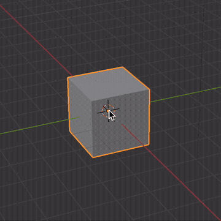{ width="256", align=right }

**Rotate Viewport**  
Click & Drag with ++middle-button++

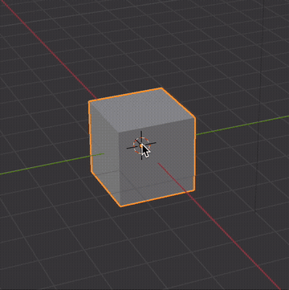{ width="256", align=right }

**Track / Pan Viewport**  
While holding ++shift++ key,  
Click & Drag with ++middle-button++

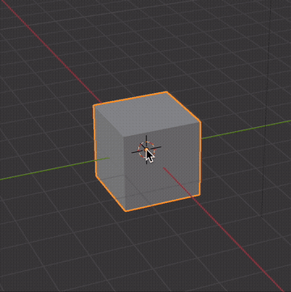{ width="256", align=right }

**Zoom Viewport**  
While holding ++ctrl++ key,  
Click & Drag with ++middle-button++

!!! note
    You can change your navigation settings to be closer to other 3D applications if preferred. 
    
    Viewport navigation is a little different in Blender compared to other 3D applications.

---

## **Selecting Objects**

- You can select an object by clicking on it in the viewport. 
- When an object is selected, it will be highlighted in light orange. It will also be highlighted in the outliner in the top right corner of the screen.

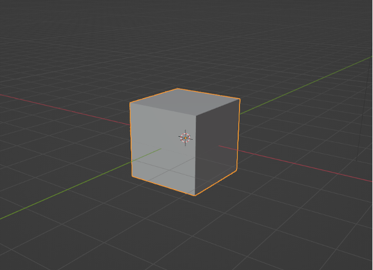{ width="320" }

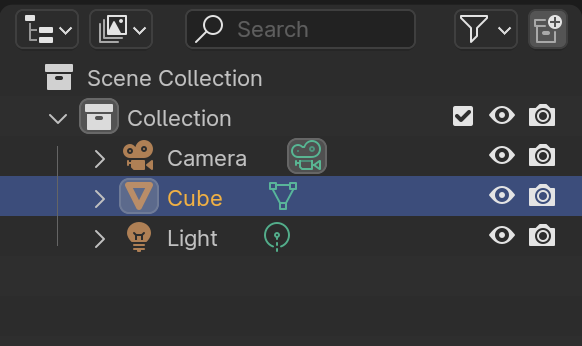{ width="320" }

---

- You can select multiple objects in the viewport by holding the ++shift++ key while clicking on the items.
- You can also select multiple objects in the outliner by holding the ++ctrl++ key while clicking on the items.
- When you do this, the active object will be highlighted in bright orange and the other objects will be a darker orange.

<figure markdown="span">
  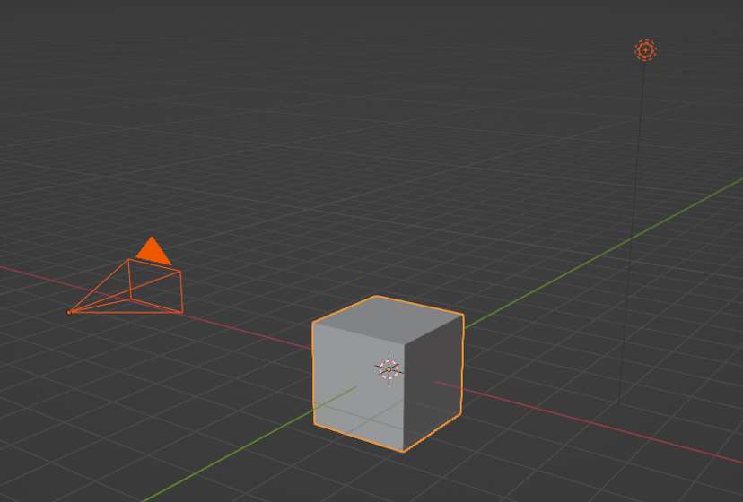{ width="600", align=right }
  <figcaption>Multiple selected objects in viewport</figcaption>
</figure>

---

## **Adding & Deleting Objects**

### **Adding an Object**

- There are two ways to ***Add*** an object, whether it’s a Mesh object, Camera, Light, etc.

- Click **Add** in the top left corner of the viewport

    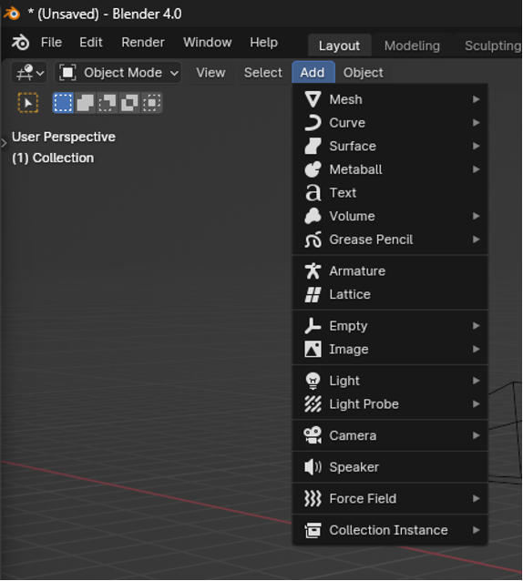{ width="300" }

- Use the keyboard shortcut ++shift+a++ to call the add menu

    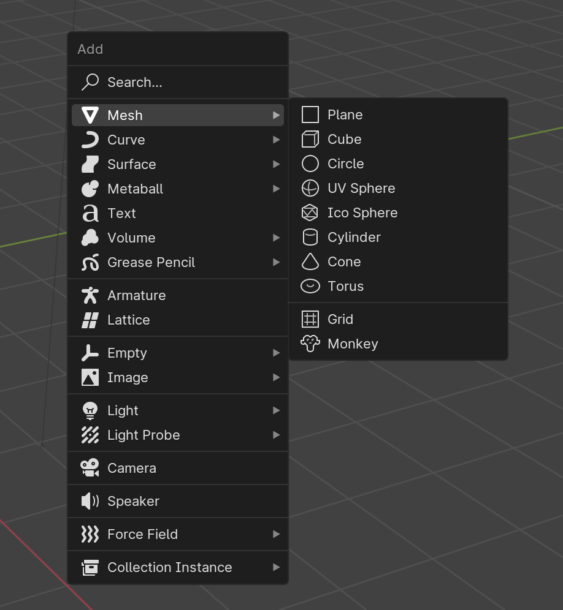{ width="310" }

- Once the add menu is open, regardless of which method you use to open it, you can either hover over each section to see the options or you can start typing to search for a specific object.

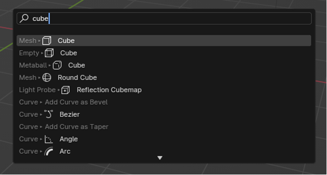{ width="400" }

### **Deleting an Object**

- To ***Delete*** an object, select it and press the ++delete++ or ++x++ key.

!!! warning
    Pressing the ++delete++ key will delete the object without an additional prompt.

---
