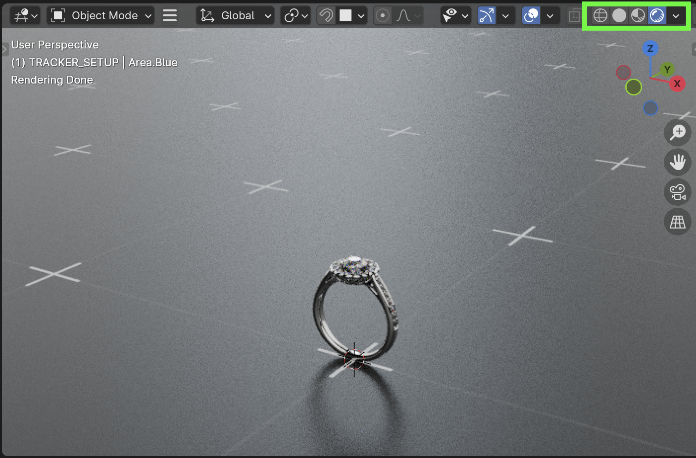
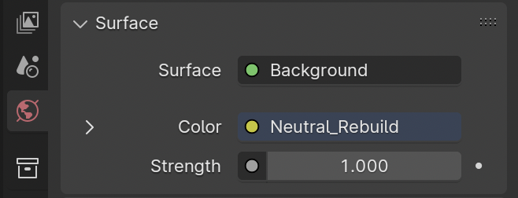
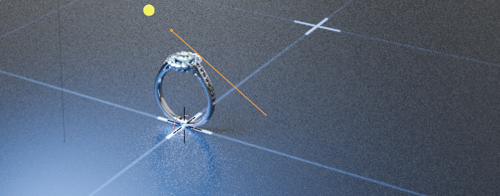
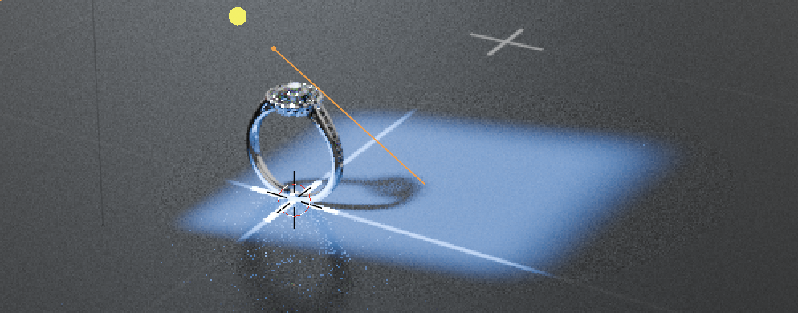
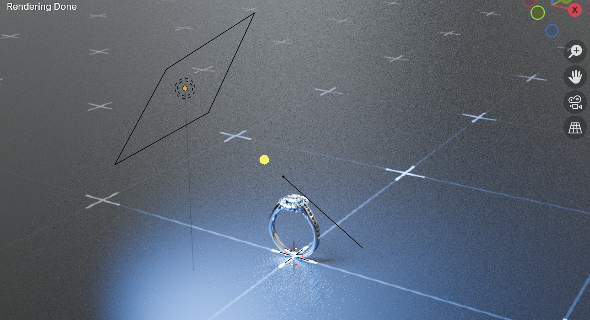
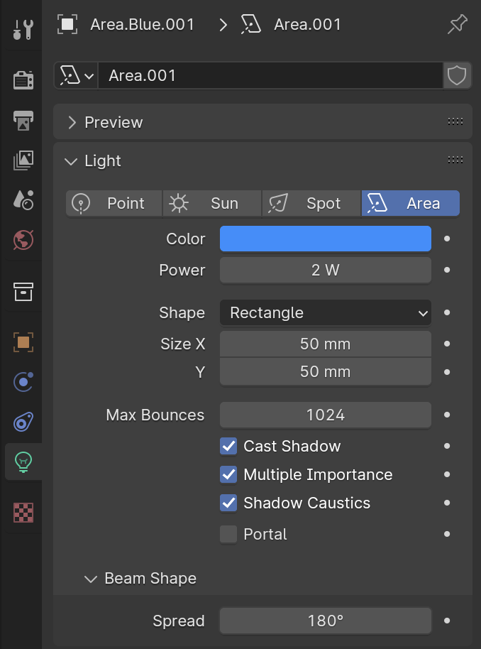
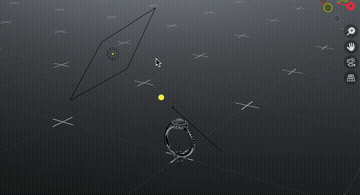

# **Lighting**

{==

The **Master** .blend file already contains lighting that can be used as a starting point for most scenes. 
It uses a simple HDRI environment for the base lighting and 3 light objects (Area, Fill, Key)

==}

- To see the lighting in your scene, select ***Viewport Shading > Rendered*** at the top of the viewport window.

<figure markdown="span">
  { width="720" }
</figure>

!!! note
    The Rendered display mode may slow down Blender considerably, depending on system hardware.

---

## **Simple Scene Lighting**

### **HDRI Light Settings**

- Adjust the HDRI lighting **Strength** in the **World Properties** panel, under the **Surface** tab.

{ width="256", align=left }

### **Light Settings**

- Color: We mainly use White here, but this can be changed depending on the creative direction
- Power: This will need to be adjusted during initial scene setup, but should remain consistent throughout projects
- Shape: Setting an Area light to **Rectangle** allows for interesting lighting effects by elongating the light source
- Max Bounces: Typically leave at 1024
- Cast Shadow and Shadow Caustics may be enabled or disabled, depending on the scene.
    - i.e. If the scene doesn’t have any gemstones, Shadow Caustics may not be needed.
- Beam Shape > Spread: A value of 180 will result in a wide/soft light source, while a value of 0 will give a harsh/sharp edge:

<figure markdown="span">
  { width="320" }
  <figcaption>Area light’s <strong>Spread</strong> set to 180</figcaption>
</figure>

<figure markdown="span">
  { width="320" }
  <figcaption>Area light’s <strong>Spread</strong> set to 10</figcaption>
</figure>

{ width="400", align=left }

{ width="400", align=left }

---

## **Duplicating Lights**

- Duplicating light objects is a quick way to light your scene.
- With a light object selected in the viewport, press ++shift+d++ and move the new light in your scene.
- You can then rotate the new light, change it’s color, intensity, etc.

<figure markdown="span">
  { width="400" }
</figure>

---
