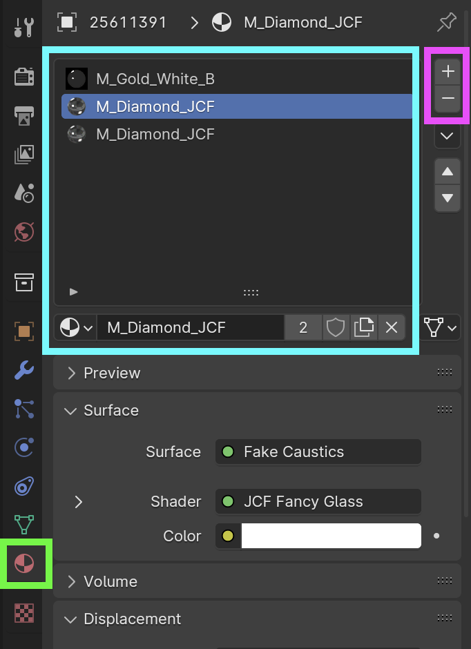
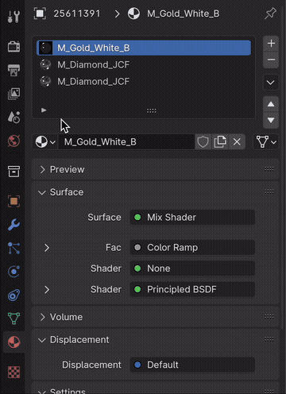
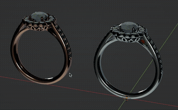

---
hide:
  - tags
tags:
  - Materials
---

# **Materials**

{==

Most of the materials needed for our purposes should already exist in the **Master** .blend file; another good reason to set it as your default Startup File.

==}

## **Material Properties panel**

- With an object is selected, open the Material Properties (green box) to see the Material Slots and any assigned Materials (blue box).
- An object must have at least 1 Material Slot in order to have a material assigned to it.
    - Material Slots can be added or removed with the ++plus++ or ++minus++ buttons (pink box)

{ width="340", align=right }

---

## **Applying Materials**

In the Material Properties panel…

1. Select a Material Slot
1. Click to browse Materials in the current .blend file
1. Select Material to assign it to the current Material Slot

{ width="340", align=right }

---

## **Linking Materials**

It can sometimes be useful to Link Materials to apply same material on multiple objects.

1. Select an object
1. ++shift+select++ another object
1. Press ++ctrl+l++
1. Select ***Link Materials*** from menu

{ width="360" }

---

!!! note
    See [***Materials Creation***](../Materials/index.html) section for more details on creating and modifying materials.

---
