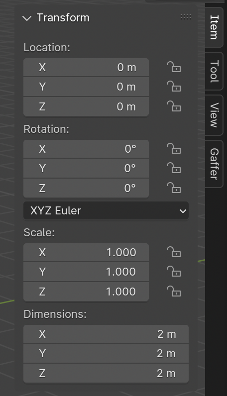

# **Object Manipulation**

## **Basic Transform**

1. Select Object
2. Press Hotkey for **Move** ++g++ , **Rotate** ++r++ , or **Scale** ++s++

!!! note
    Transforms are typically oriented according to current viewport

---

## **Transform an object along a specific axis**

1. Select Object
2. Press Hotkey for **Move** ++g++ , **Rotate** ++r++ , or **Scale** ++s++
3. Press ++z++ , ++x++ , or ++y++ keys to select axis
4. Type a number to set a specific value (optional)

---

## **Item Tab / Panel**

1. Open the **Sidebar** (menu) by pressing the ++n++ key
1. Select the **Item Tab** to see transform values  (Location, Rotation, Scale, Dimensions)
1. Change by ++left-button++ click + dragging on attribute value,  OR clicking on attribute value and typing in new value

{ width="256", align=left }

---
