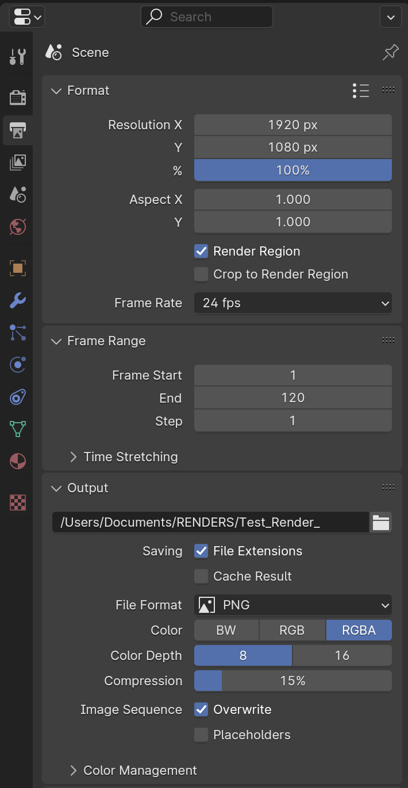
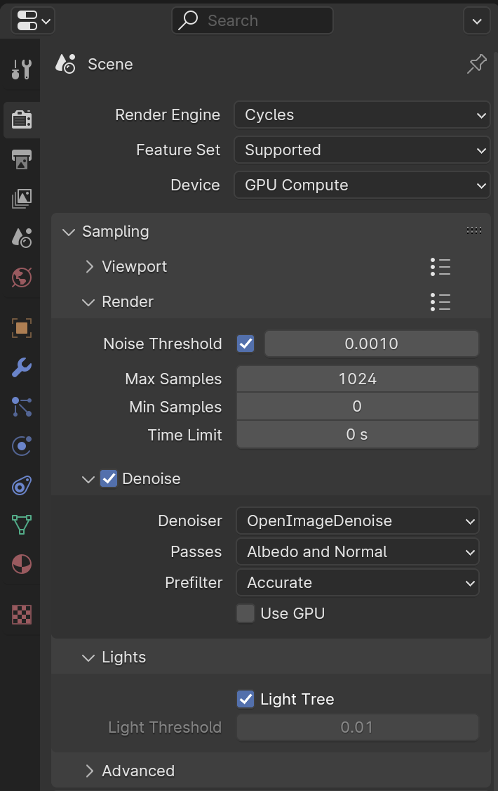
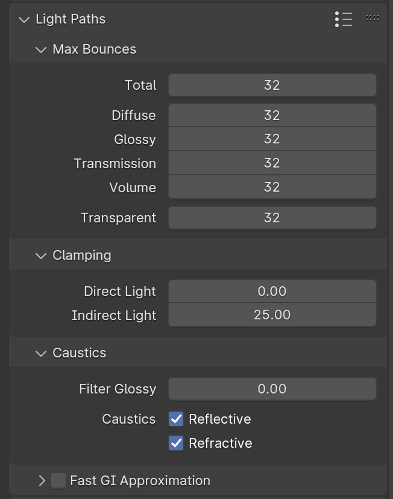
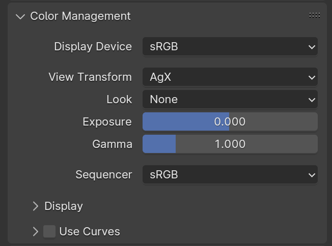

# **Render Settings**

{==

Render and Output settings are already set in the **Master** .blend file, and these settings can be used as a starting point for most scenes.

==}

## **Output Properties**

- This is where you define the output resolution, file type, and frame rate (for animated content)

### **Format**
- Adjust **Resolution %** to as a simple way to save rendering time for previews
    - 25-50% for draft renders
    - 100-200% for final renders
        - Scale down final image 50% if final render is 200%

### **Output**
- Click on the folder icon to select the directory to save the rendered image/animation.
- This is also where to define the file name.

{ width="320", align=right }

---

## **Render Properties**
- We primarily use the Cycles render engine for beauty shots.
- There are presets in this panel that should suffice for most cases, but not all of these settings need to be adjusted every time.

### **Sampling**
- **Noise Threshold** : ~0.0005 (0.01 or lower)
- **Max Samples** : 1024 (or higher, up to 4096)
- **Denoise** : Try with and without
    - Automatic
    - Albedo
    - 16000 samples?

{ width="320", align=right }

### **Light Paths**

- **Max Bounces** : It’s best to use the same number for all of these passes, i.e. 32 bounces for “Total” through “Transparent”
- **Clamping > Indirect Light** : Higher values can help with light dispersion in renders with gemstones, but WILL increase render time
- **Caustics > Filter Glossy** : 0

{ width="300", align=right }

### **Color Management**

- **View Transform** : AgX
    - Set to ***False Color*** to identify any lighting issues
- **Look** : None
- **Exposure** : 0
- **Gamma** : 1

{ width="300", align=right }

---
