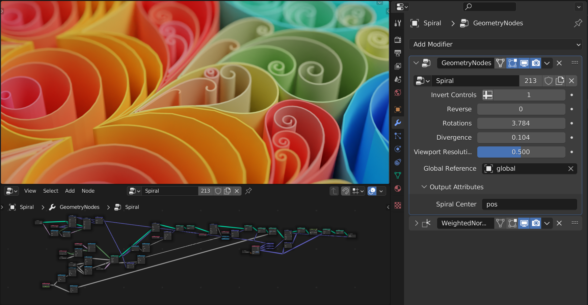

---
hide:
  - tags
tags:
  - Learning Lunch
---

# **Geometry Nodes**

{==

A system for modifying the geometry of an object with node-based operations.

The [Blender 4.2 Manual](https://docs.blender.org/manual/en/dev/)
by the [Blender Documentation Team](https://projects.blender.org/blender/documentation)
is licensed under a [CC-BY-SA v4.0](https://creativecommons.org/licenses/by-sa/4.0/).

==}

<figure markdown="span">
  { width=960" }
  <figcaption>The properties of a Geometry Nodes modifier in the modifier stack.</figcaption>
</figure>

---
