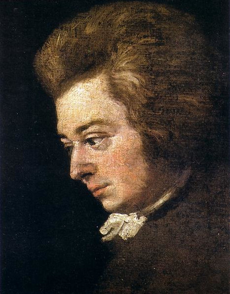
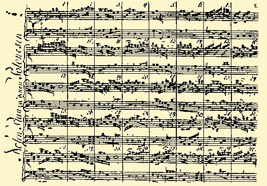
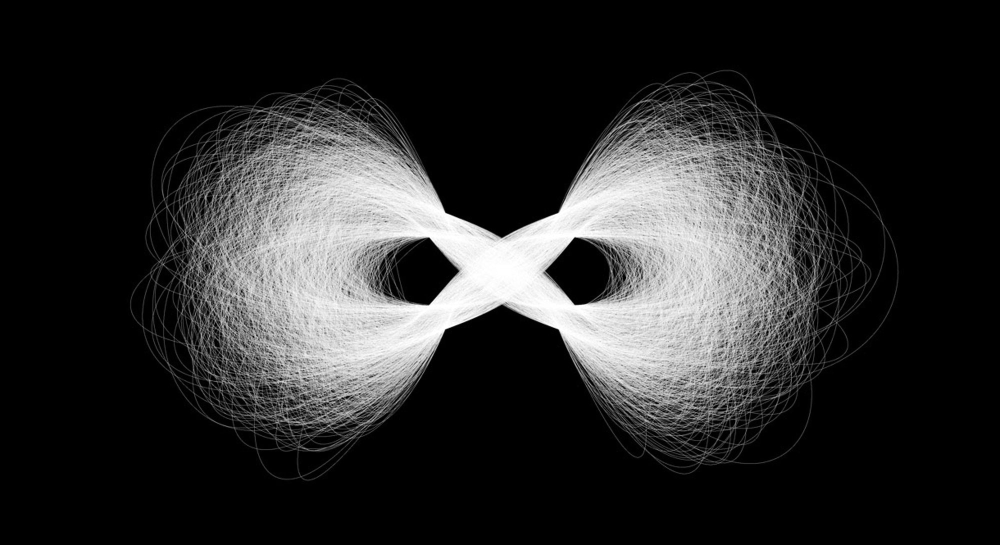
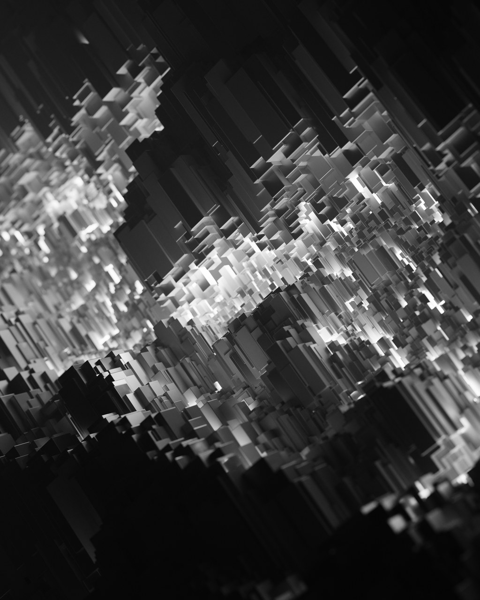
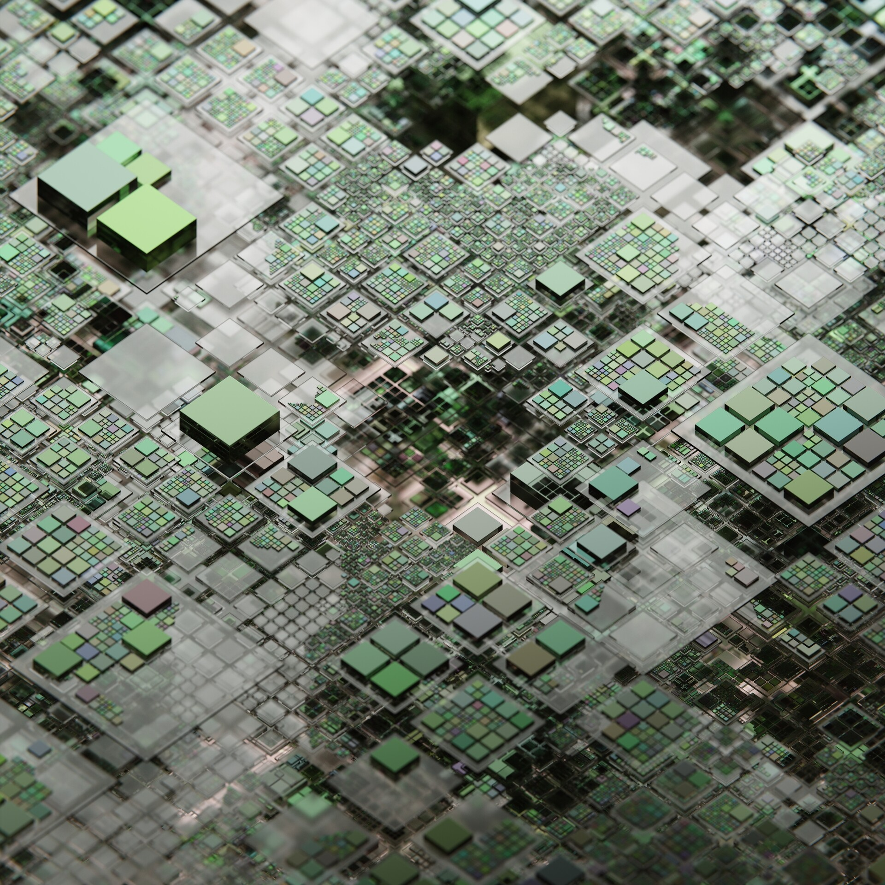
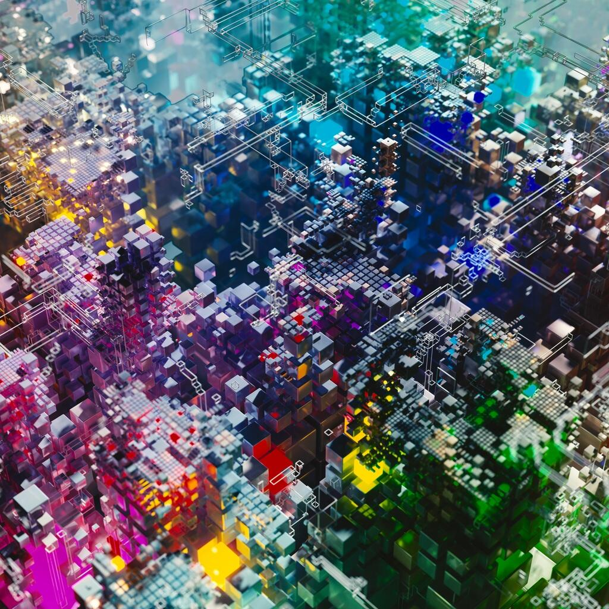

---
hide:
  - tags
tags:
  - Learning Lunch
---

# **Generative art**

{==

Generative art (Generative design) is artwork that is created with the use of an autonomous system, in our case with algorithms or computer code.

==}

!!! note ""
    Artists have been experimenting with generative methods for centuries to introduce randomness into their artwork to stimulate creativity.

<figure markdown="span">
  { width="186", align=right }
  <figcaption>Wolfgang Amadeus Mozart</figcaption>
</figure>

<figure markdown="span">
  { width="400", align=left }
  <figcaption>Musikalisches Würfelspiel (German for "musical dice game")</figcaption>
</figure>

!!! DIVIDER ""

# **Early Examples**

<figure markdown="span">
  { width="600" }
  <figcaption>AI Infinity - John Maeda, 1994</figcaption>
</figure>

<figure markdown="span">
  { width="600" }
  <figcaption>Substrate - Jared Tarbell, 2003</figcaption>
</figure>

!!! DIVIDER ""

# **Geometry Node Examples**

<figure markdown="span">
  { width="600" }
  <figcaption>Credit: Midge "Mantissa" Sinnaeve</figcaption>
</figure>

<figure markdown="span">
  { width="600" }
  <figcaption>Credit: Midge "Mantissa" Sinnaeve</figcaption>
</figure>

<figure markdown="span">
  { width="600" }
  <figcaption>Credit: Midge "Mantissa" Sinnaeve</figcaption>
</figure>

<figure markdown="span">
  { width="600" }
  <figcaption>Credit: Midge "Mantissa" Sinnaeve</figcaption>
</figure>

---
