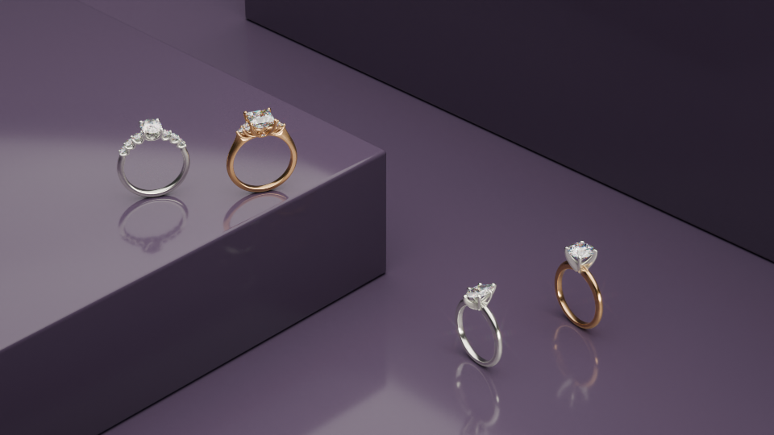

---
hide:
  - tags
tags:
  - Learning Lunch
---

# **Uses**

{==

We can use these methods to create 3D environments that can be used for product beauty shots, anytime a project calls for renders.

==}

<figure markdown="span">
  { width="600" }
  <figcaption>Placing product on risers</figcaption>
</figure>

<figure markdown="span">
  { width="600" }
  <figcaption>Impractical setup</figcaption>
</figure>

<figure markdown="span">
  { width="600" }
  <figcaption>Maybe?</figcaption>
</figure>

---
