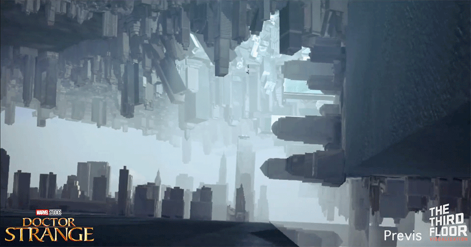
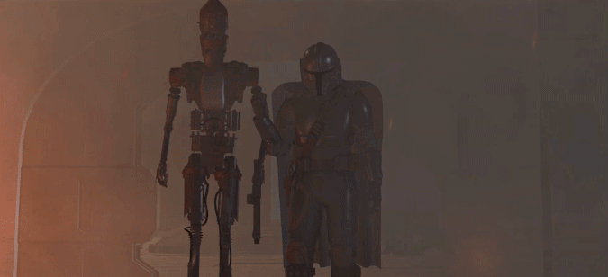

---
hide:
  - tags
tags:
  - Learning Lunch
---

# **Previs**

{==

Previsualization, or previs, allows for experimentation with different staging, lighting, and camera positions, without the need for physical products or other objects.

==}

<figure markdown="span">
  { width="600" }
  <figcaption>Credit: THE THIRD FLOOR</figcaption>
</figure>

<figure markdown="span">
  { width="600" }
  <figcaption>Credit: THE THIRD FLOOR</figcaption>
</figure>

---
