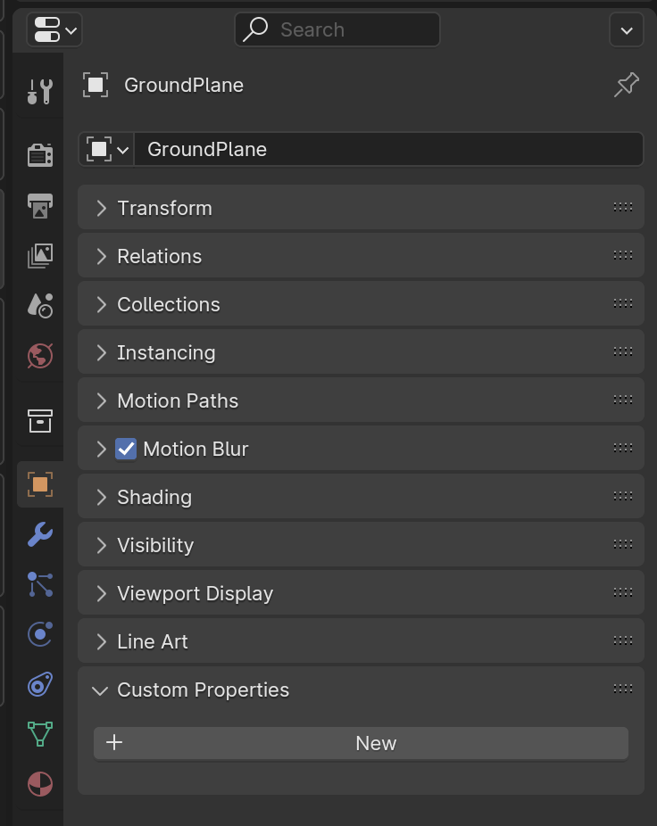
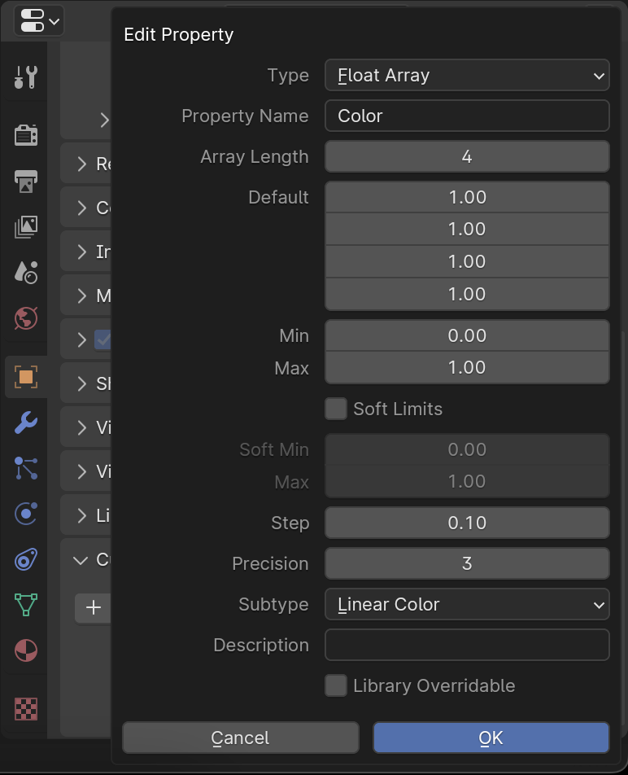
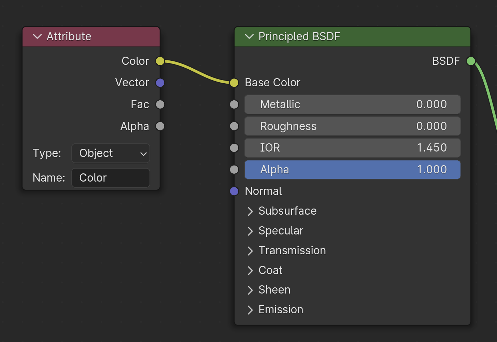
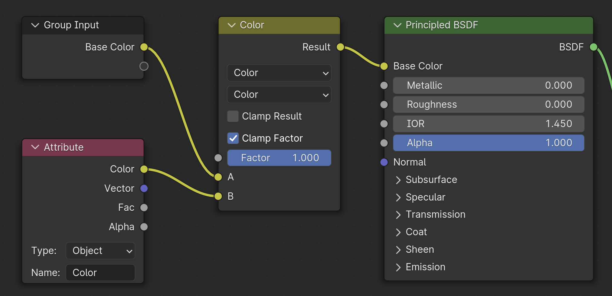

---
hide:
  - toc
  - tags
tags:
  - Materials
---

# **Custom Properties**

- Can be used on objects to set specific material properties per instance, while using a shared *base* material, allowing for quick edits.
- If an object has the named Custom Property, that value will overwrite the color set in the Material Properties.
- If an object does NOT have it, the color can be set through the Material Properties.

## **Create a New Custom Property**

1. Select **Object Properties** panel
1. Custom Properties > ***New***

{ width="280", align=right }

## **Set the following properties**

- **Type** : Choose the data type (e.g., Float, Integer, Boolean, String)
- **Default Value** : Set the initial value for the property
- **Min/Max** : Define the minimum and maximum values (if applicable)
- **Soft Limits** : Enable soft limits for the Property Value slider
- **Step** : Specify the increment multiplier

{ width="320", align=right }

---

## **Copy Selected Custom Properties**

Copy to any object/instance that needs to share materials

!!! warning
    **Copy Attributes** add-on must be enabled in Blender preferences

1. Select any Object(s) to copy Custom Property to
1. ++shift+select++ the Object with the Custom Property
1. Copy using ++ctrl+c++
1. Select ***Copy Selected Custom Properties***

!!! note
    Make sure objects have same material(s) applied

---

## **Add Attribute Node in Material**

- **Type** : Object
    - For Instanced objects, **Type** : Instancer
- **Name** : Name_of_Custom_Property

<figure markdown="span">
  { width="282" }
  <figcaption>Connect Color to Base Color</figcaption>
</figure>

<figure markdown="span">
  { width="400" }
  <figcaption>Or use Mix Color node to mix with Base Color</figcaption>
</figure>

---
