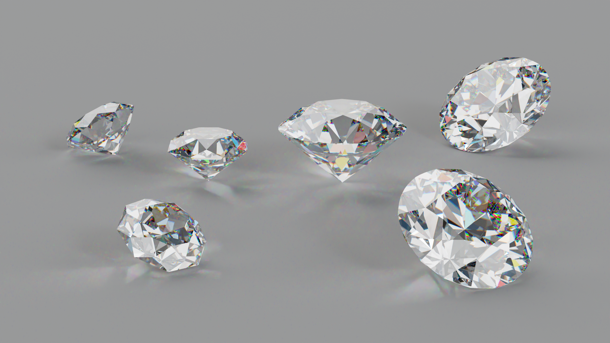
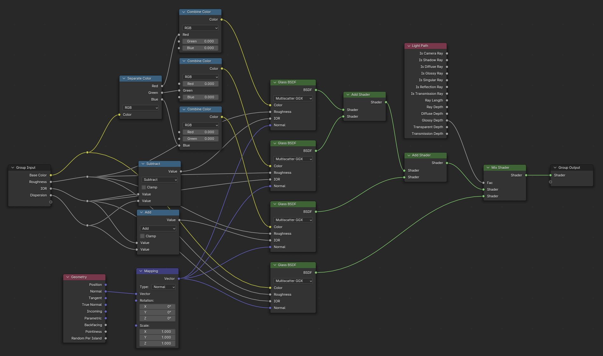
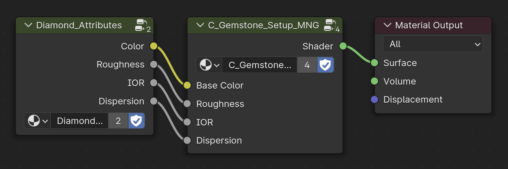
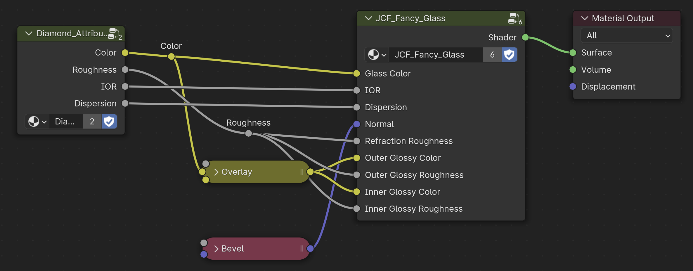
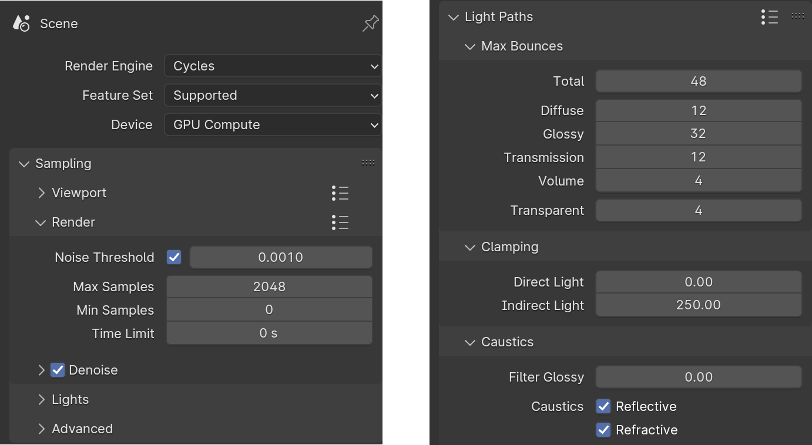
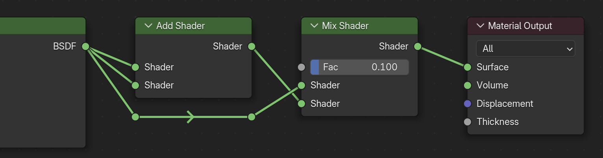
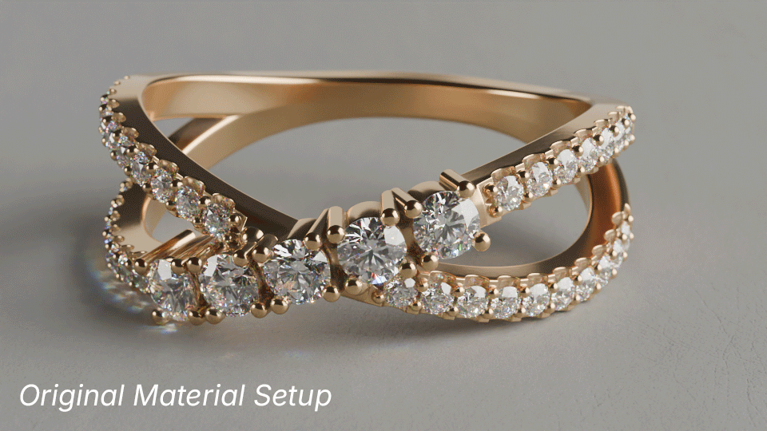

---
hide:
  - tags
tags:
  - Materials
  - Nodes
---

# **Diamonds & Gemstones**

<figure markdown="span">
  { width="800" }
  <figcaption><em><strong>C_Diamond</strong></em> material</figcaption>
</figure>

!!! note
    Gemstone Materials can also be organized into Node Groups

## **C_Gemstone_Setup**
The original shader setup for most Gemstone materials created for catalog beauty shot renders.

<figure markdown="span">
  { width="800" }
  <figcaption>Contents of <em><strong>C_Gemstone_Setup_MNG</strong></em></figcaption>
</figure>

- This Node Group can be used as a starting point for most Gemstone types.
- Base Color, Roughness, Index of Refraction (IOR), and Dispersion values should be all that’s needed to make almost any Gemstone material.
    - As previously mentioned, these attributes can be defined in a single node group.

<figure markdown="span">
  { width="800" }
  <figcaption><em><strong>C_Gemstone_Setup_MNG</strong></em> Node Group using the <em><strong>Diamond_Attributes</strong></em> Node Group as input</figcaption>
</figure>

---

## **JCF Fancy Glass**
Alternative shader setup that can also be used for beauty shot renders.

- Similar to C_Gemstone_Setup_MNG, this Node Group can be used as a starting point for most Gemstone types.

<figure markdown="span">
  { width="600" }
</figure>

---

### **Recommended Render Settings for JCF Fancy Glass**

<figure markdown="span">
  { width="600" }
</figure>

- **Max Samples** : At least 1024
- **Noise Threshold** : 0.001 for preview, around 0.00025 for final
- **Indirect Light** : 250 for low samples, up to around 1000 for high samples

---

## **Increasing Brightness**

<figure markdown="span">
  { width="600" }
  <figcaption>Added Material Nodes</figcaption>
</figure>

<figure markdown="span">
  { width="400" }
</figure>

- Plug a shader's output into *BOTH* inputs of an ***Add Shader***
- Plug that output into a ***Mix Shader*** to adjust the amount of extra brightness.

---
