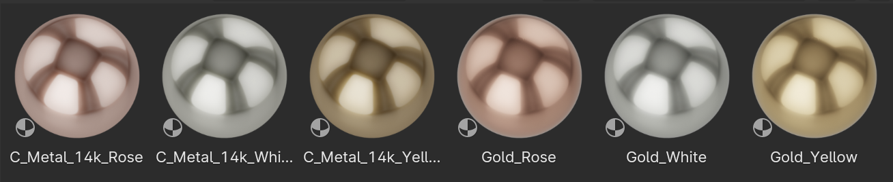
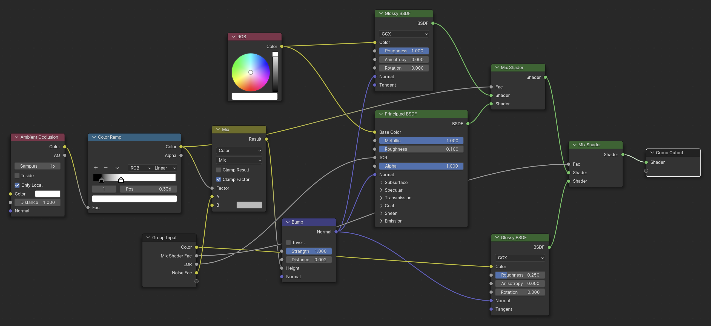
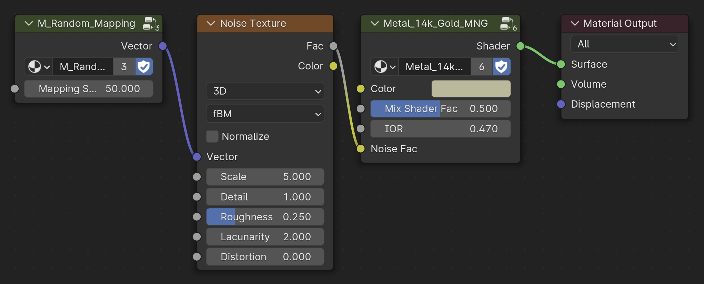
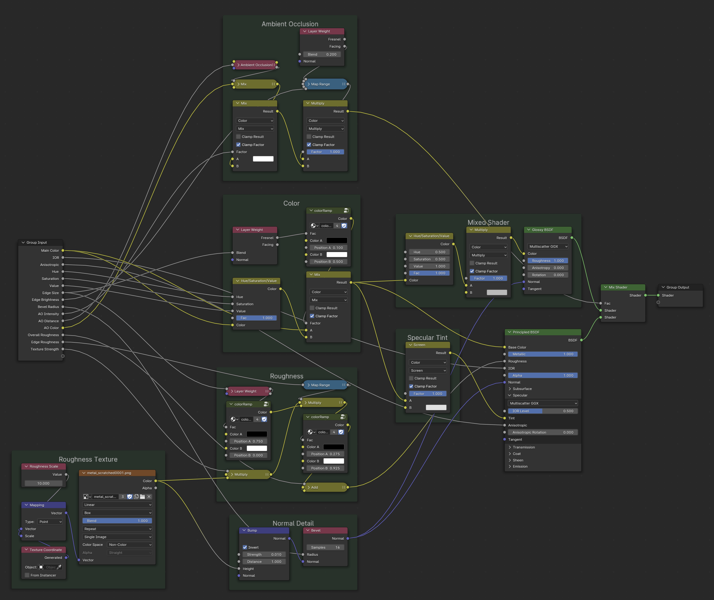
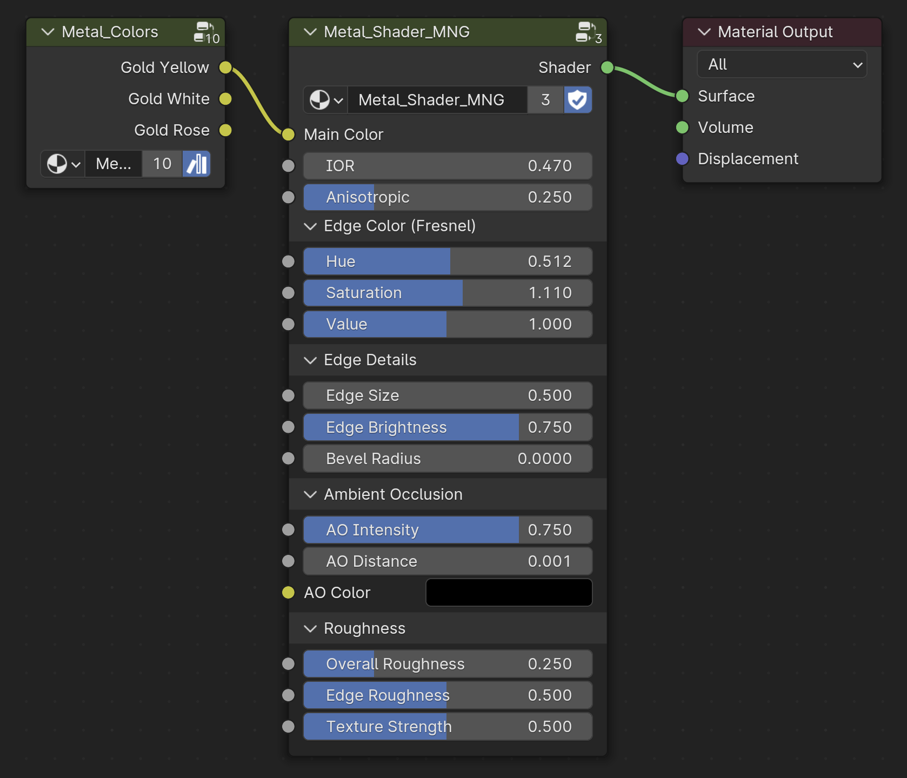

---
hide:
  - tags
tags:
  - Materials
  - Nodes
---

# **Metals**

<figure markdown="span">
  { width="800" }
  <figcaption><em><strong>C_Metal_14k_Yellow</strong></em> material</figcaption>
</figure>

<figure markdown="span">
  { width="800" }
  <figcaption>Metal Materials in Asset Browser Library</figcaption>
</figure>

!!! note
    Current Metal Materials have been organized into Node Groups

## **Metal 14k Gold**
The original shader setup for all 14k Gold materials created for catalog beauty shot renders.

<figure markdown="span">
  { width="800" }
  <figcaption>Contents of <em><strong>Metal_14k_Gold_MNG</strong></em></figcaption>
</figure>

This Node Group is used in the following Materials:

- C_Metal_14k_Yellow
- C_Metal_14k_White
- C_Metal_14k_Rose

<figure markdown="span">
  { width="800" }
  <figcaption><em><strong>Metal_14k_Gold_MNG</strong></em> as used in <em><strong>C_Metal_14k_White</strong></em> material</figcaption>
</figure>

---

## **Metal Shader**
Alternative shader setup that can also be used for beauty shot renders.

<figure markdown="span">
  { width="800" }
  <figcaption>Contents of <em><strong>Metal_Shader_MNG</strong></em></figcaption>
</figure>

This Node Group is used in the following Materials:

- Gold_Yellow
- Gold_White
- Gold_Rose

<figure markdown="span">
  { width="800" }
  <figcaption><em><strong>Metal_Shader_MNG</strong></em> as used in <em><strong>Gold_Yellow</strong></em> material</figcaption>
</figure>

---
