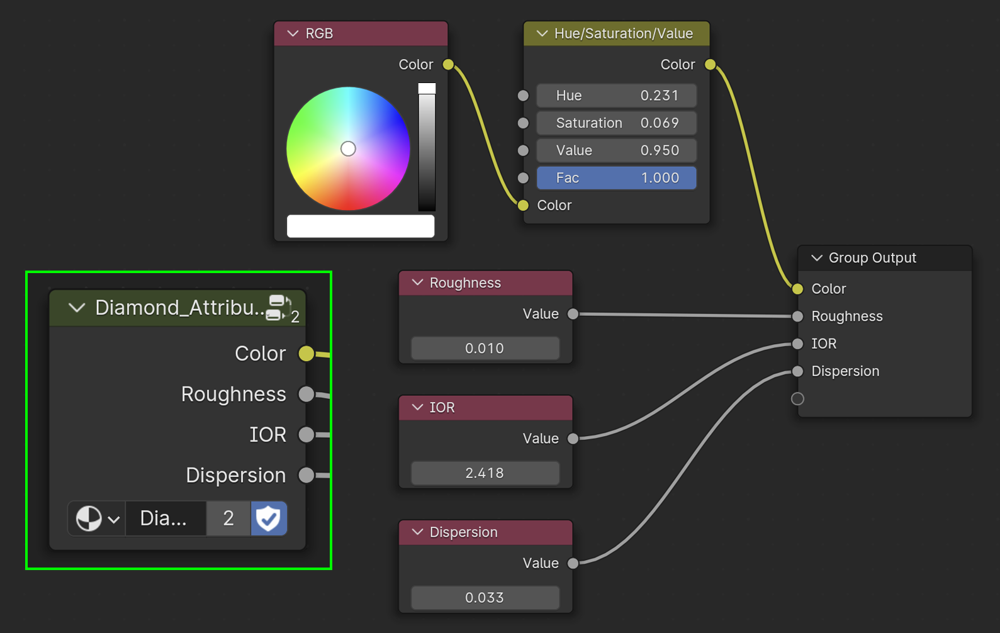

---
hide:
  - toc
  - tags
tags:
  - Materials
  - Nodes
---

# **Node Groups**
Complex shader setups can be grouped into Node Groups to be reused by multiple materials.

For most cases, materials should be shared across projects for consistency.
When rendering for catalogs and beauty shots, yellow gold should always be yellow gold, a diamond should always be a diamond, etc.

A useful workflow for keeping consistency across materials in Blender is by defining commonly used attributes in a single node group:

<figure markdown="span">
  { width="800" }
  <figcaption>The Node Group <em><strong>Diamond_Attributes</strong></em> (inset) and its contents</figcaption>
</figure>

Select a node group and press ++tab++ to see its contents, and then press ++tab++ again (or ++ctrl+tab++) to exit the group and go back to its parent.

Color values, IOR values, Roughness, etc. can be contained and defined in a Node Group.
This way, if the color of a particular metal or gemstone needs to be updated, it should be easier to apply that update to the necessary materials.

!!! note
    Ideally, we should only be editing materials, node groups, etc. in a single, master file.

Currently using the following Node Groups to define global colors:

- Metal_Colors
- Background_Colors

---

## **Naming Convention Suffixes**
In Blender, Node Groups can be used in Materials, Compositing, and Geometry Nodes.
Add a corresponding suffix when naming a new Node Group:

| Suffix  | Description              |
| :------ | :----------------------- |
| MNG     | *Material Node Group*    |
| CNG     | *Compositing Node Group* |
| GNG     | *Geometry Node Group*    |

---
