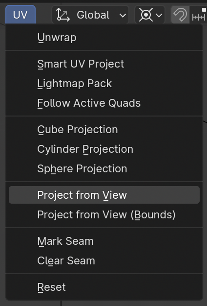
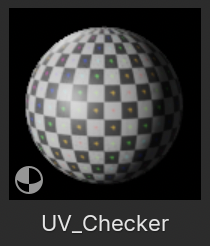
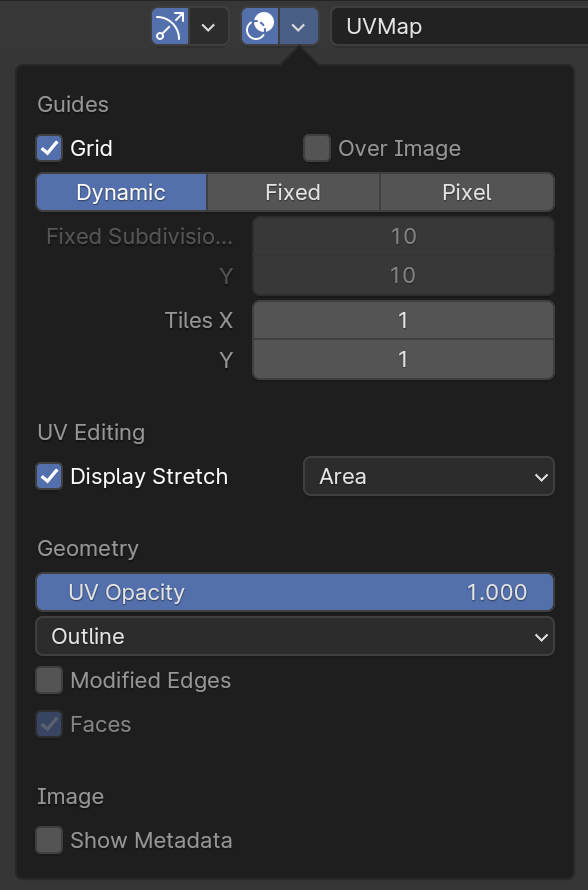
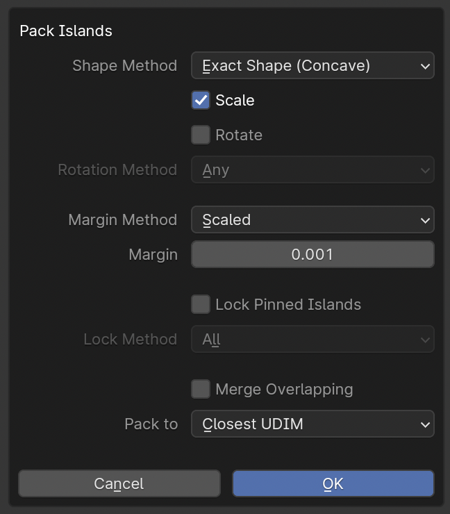

---
hide:
  - tags
tags:
  - Materials
  - UVs
---

# **UV Mapping**

1. In Object Mode, ***Apply Scale*** on Object ++ctrl+a++
1. Go to UV Editing tab
1. Go to Edit Mode ++tab++ , switch to Faces ++3++ , select all Faces ++a++ , 3D Viewport > UV menu > ***Project from View***
    - This gives us a clean starting point
1. In Edit Mode, switch to Edges ++2++ and select Edge Loops
    - Select Edge Loops ++alt+left-button++ click
    - Select Multiple Edges ++alt+shift+left-button++ click
    - Select Edges on Path ++ctrl+left-button++ click
1. With Edges Selected, ++right-button++ click, ***Mark Seam***
1. In Edit Mode, with all Faces selected, select all UVs in UV Editor ++a++ , ++right-button++ click, ***Unwrap***

{ width="280", align=right }

---

## **Checking UVs**

### **With a Material…**

- UV Editor > New Image > Name something like ***UV_Checker***
- Generated Type: UV Grid
- Or just apply ***UV_Checker*** material from the Asset Browser

{ width="200", align=right }

### **With Distortion Overlay**

- UV Editor > Overlay Menu > Display Stretch > Area
- Should be mostly Blue (some Green okay)

{ width="240", align=right }

---

## **UV Packing**

1. Object Mode, select Object(s)
1. Edit Mode, select all Faces ++a++
1. UV Editor, select all UVs ++a++
1. UV Editor > UV menu > ***Average Islands Scale***
    1. Ensures same texel density for all objects
1. UV Editor > UV menu > ***Pack Islands***

{ width="280", align=right }

---

## **Simple Texturing for Props**

1. Make sure to **Apply Scale**!
1. Select Object > Object Data Properties > ***Texture Space***
1. Disable ***Auto Textures***
1. Set Size X, Y, Z to ***1.0***

!!! warning
    This only works if the Material applied uses the ***Generated*** Texture Coordinate

---
