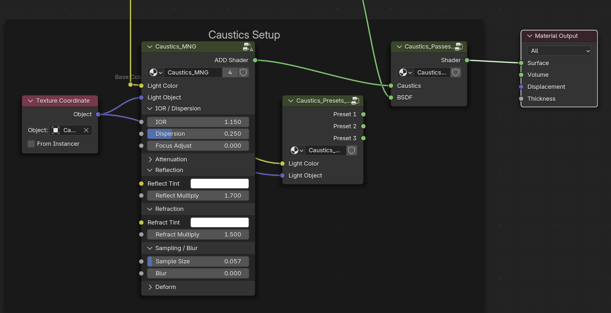
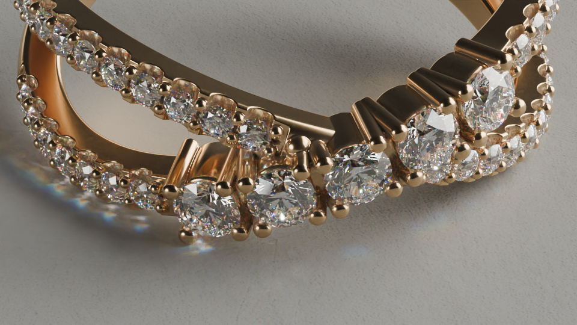
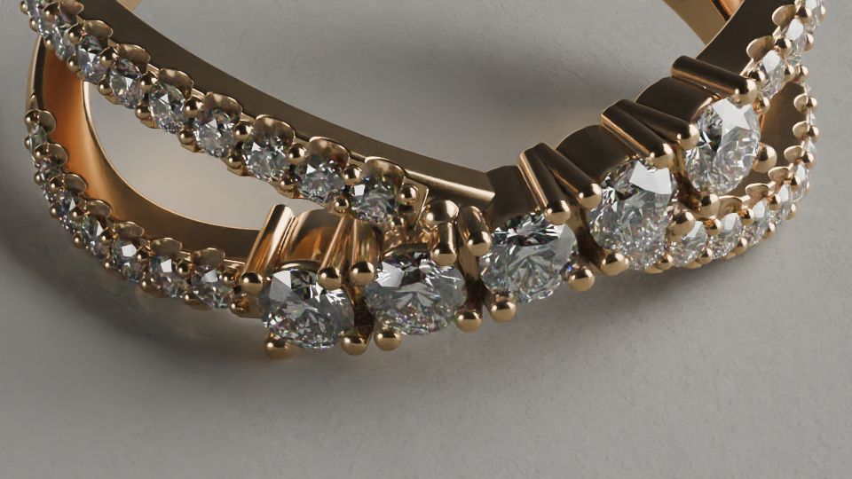

---
hide:
  - tags
tags:
  - Lighting
  - Rendering
  - Materials
---

# **Caustics**

{==

The light that gets focused through glass or water

==}

Caustics play a significant role in the amount of light present in a scene.

!!! note ""
    In computer graphics, a caustic is any contribution of light that originates from a light source, reflects or refracts off a specular surface, and is ultimately observed by the eye or camera.

## **Faking Caustics Using Shaders**

Blender doesn't produce the best caustics natively.  Some tricks / hacks can be used to get the desired results.

<figure markdown="span">
  { width="720" }
  <figcaption>Caustics Shader Setup combined with Diamond Shader</figcaption>
</figure>

=== "With Caustics Shader"

    { width="400" }

=== "Without Caustics Shader"

    { width="400" }

- Position the ***Caustics_Light_Source*** and ***Caustics_Light_Target*** to control the direction of the caustics.
- **Caustics_Light_Source** : Placement should mimic an actual light source in the scene for believable results
- **Caustics_Light_Target** : Placement should be near diamonds / gemstones or metal surfaces

---

### **Render Settings for Caustics**

#### **Sampling**
- **Noise Threshold** : ***0.01*** for Final
    - Lower values may not produce significantly better results
- **Max Samples** : ***1024*** (Minimum)
    - Higher values may not produce significantly better results
- **Light Tree** : ***Disable***
- **Light Threshold** : ***0.01***

#### **Light Paths**
- **Max Bounces** : ***32-128*** for each (48 good)
- **Clamping > Indirect Light** : ***100-150*** (for diamonds and gemstones)
    - 0 = Unlimited

#### **Film**
- **Pixel Filter** : ***Blackman-Harris***
- **Width** : ***1.0***

---

!!! note
    The traditional method of creating caustics may not work properly with HDRI or Emissive Lights, only direct light sources, whereas the shader method should work with all light sources.

---

## **Traditional Caustics Setup**
Setting up the scene the standard way is a bit more complicated.

=== "Objects"

    **On Main Objects (Product)**

    - **Object Properties > Shading > Caustics**
        - Enable ***Cast Shadow Caustics***

=== "Environment"

    **On Ground, Environment, Background Objects**

    - **Object Properties > Shading > Caustics**
        - Enable ***Receive Shadow Caustics***

=== "Lights"

    **On Lights (Area, Point)**

    - **Object Data Properties**
        - Enable ***Shadow Caustics***

    **On HDRI / Environment Lighting**

    - **World Properties > Settings > Surface**
        - **Sampling** : ***Auto***
        - **Max Bounces** : ***1024***
        - Enable ***Shadow Caustics***

---

## Lights
**In General:**

- Light Closer = Tighter Caustics
- Further = Wider, More White Caustics

---
