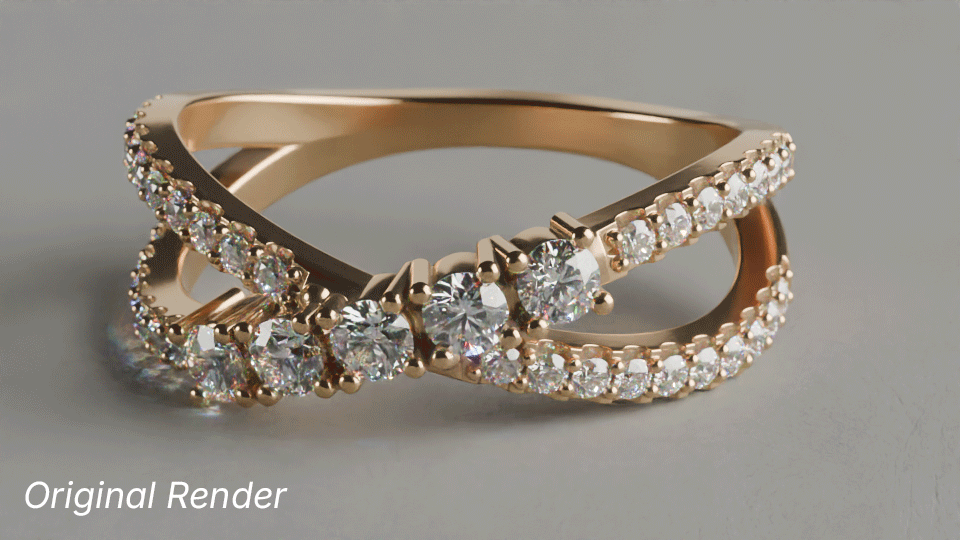
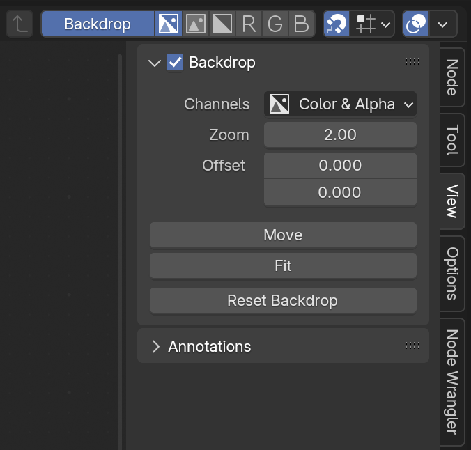
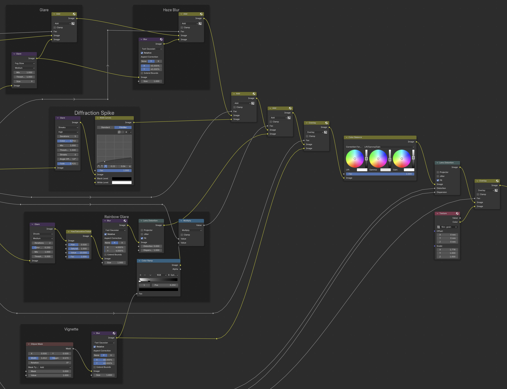
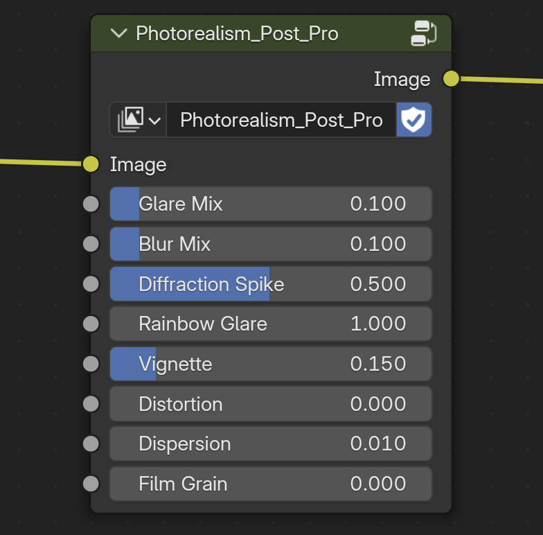

---
hide:
  - tags
tags:
  - Lighting
  - Rendering
  - Compositing
---

# **Compositing Final Images**

{==

Using Compositing Nodes to enhance renders so they’re closer to final right out of Blender

==}

<figure markdown="span">
  { width="600" }
</figure>

---

## **Compositing Tab**

<figure markdown="span">
  { width="256" }
</figure>

- Enable ***Use Nodes***
    - Make sure to have ***Node Wrangler*** extension / addon enabled in settings
- ++ctrl+shift+left-button++ click on the image node to add a **Viewer node** if one doesn't already exist
- **View** (sidebar) > click ***Fit***

---

## **Compositing Nodes**

!!! note
    Some of these are not always needed, and all of them are dependent on the scene.

<figure markdown="span">
  { width="600" }
  <figcaption>Node Tree in Compositor view</figcaption>
</figure>

<figure markdown="span">
  { width="320" }
  <figcaption>Photorealism_Post_Pro node group</figcaption>
</figure>

- The node setup above is saved as a Node Group named ***Photorealism_Post_Pro*** that can be appended to any .blend file.

### **Lens Distortion** (Chromatic Aberration)
- Fit: ***Enable***
- Dispersion: ***0.01***

### **Color Balance**
- **Correction For**… ***Offset/Power/Slode (ASC-CDL)*** or ***Lift/Gamma/Gain***
- Essentially Shadows/Midtones/Highlights
- Adjust gray bars first, starting with ***Power*** / ***Gamma***
- Look at ***Scopes*** tab in ***Waveform***
    - Try to have a balanced profile (i.e., most stuff in middle, with a range from top to bottom)
    - Any information at very top is probably blown-out highlights
- Adjust colors mostly in ***Offset*** / ***Lift*** and ***Slode*** / ***Gain*** to change image temperature

### **Despeckle**
- Threshold: ***0.25***
- Neighbor: ***0.5***
- Fac: ***1.0***

### **Tonemap**
- Intensity: 0
- Contrast: 0.058
- Adaptation: 0.421
- ColorCorrection: 0

### **Glare**
- Streaks / Simple Star
- High
- Iterations: 5 / 3
- Color Modul: 0.25
- Mix: 1 / -0.5
- Threshold: 0.4 / 2.0
- Streaks: 4
- Angle Offset: 45
- Fade: 0.925 / 0.995
- Rotate: 45

!!! note
    *Lighting may need to be adjusted to add/remove glare hotspots*

### **Color Mix**
- One set to “Add”
    - Fac: adjusts Glare amount
    - Top Image: Render Layers (Image) (or Color Mix (Mix) for Alpha)
    - Bottom Image: Glare node
- One set to “Mix” (mainly for Alpha?)
    - Check “on” Alpha
    - Top Image: black
    - Bottom Image: Render Layers (Image)

---
