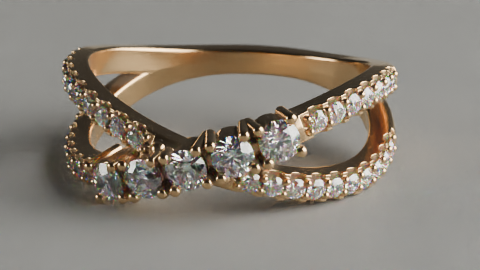
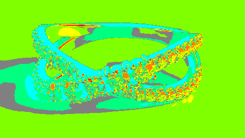
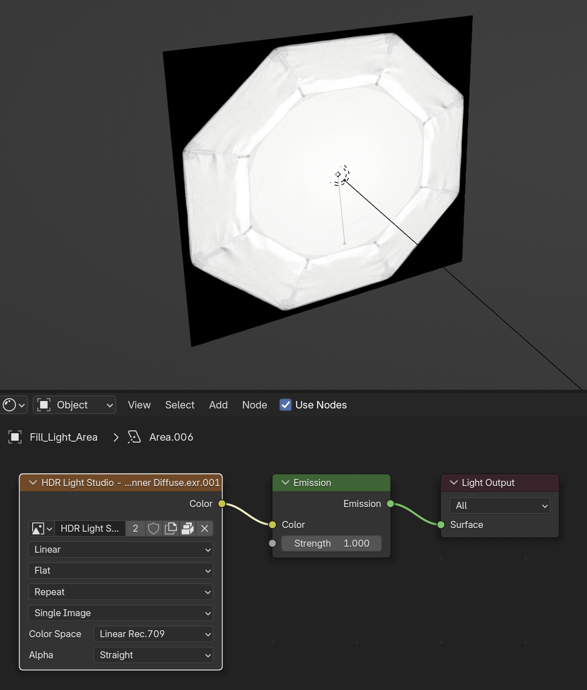

---
hide:
  - tags
tags:
  - Lighting
---

# **Lighting the Scene**

{==

Scene Lighting Setups, Settings, and Tips

==}

## [**Lighting Basics**](../BlenderOverview/Lighting.html)
- Simple Scene Lighting and Settings (From [***Blender Overview***](../BlenderOverview/index.md))

!!! DIVIDER ""

## [**Three Point Lighting**](Three_Point_Lighting.html)
- Simple method to achieve a quick studio lighting setup

!!! DIVIDER ""

## [**HDRI Lighting**](HDRI_Lighting.html)
- A useful tool to achieve realistic lighting

!!! DIVIDER ""

## **Lessons from Traditional Photography**
- For diamonds, start with continuous soft, natural, diffuse lighting
    - Add other lights to catch prismatic colors
- Single point light source above the stone that shines down through the flat table of the stone then refracts off the facets can be the key to getting the sparkle off the facets of the diamond.
    - If more than one light is used the clarity and apparent intensity of the sparkle can diminish.

!!! DIVIDER ""

!!! warning "Advanced Topics"
	The following are more advanced topics / tips that can help in achieving more realistic renders but at the cost of render time / resources.

---

## [**Caustics**](Caustics.html)
- The light that gets focused through glass or water

!!! DIVIDER ""

## **False Color View Transform**
*Used to Check Scene Light Intensity*

- Ideally, only SOME orange and dark blue, mostly green or yellow
- Adjust Exposure to get desired result
- Adjust intensity of light to match result from adjusting exposure, but with the exposure set to 0
	- Use a rough scale of .1 increase in exposure equals 2x the intensity on the light
	- So a 10W light would increase to 20W to match the exposure set to 1.1

<figure markdown="span">
  { width="400" }
  <figcaption>Final Render</figcaption>
</figure>

<figure markdown="span">
  { width="400" }
  <figcaption>False Color preview</figcaption>
</figure>

!!! DIVIDER ""

## **Textured Area Lights / Planes**

<figure markdown="span">
  { width="400" }
  <figcaption>Texture applied to Area Light</figcaption>
</figure>

- Apply Softbox Textures to Area Lights / Planes for more realistic lighting effects
- Connect the ***Color*** of the texture to the ***Color*** of an **Emission Node**

!!! DIVIDER ""

## **Lighting and Reflection Control**
- Use a combination of soft lighting and reflectors or diffusers to eliminate harsh shadows and control reflections.
- Reflectors can bounce light onto the jewelry to highlight specific details.
- Diffusers help soften and disperse light for a more even illumination.

***Assets > Lighting > Extras***

- Light_Diffuser
    - Placed roughly in between light and subject
    - Area Light Power should be reduced by at least half
    - Can help stones pop
- Reflection_Plane
- Reflector_Plane

---

**placeReflection_blender**

- Add or Select Light Object
- *Object >* ***Place Reflection***
    - Or in Viewport > Tool panel
- ++left-button++ + drag to define point of reflection
- Mouse wheel to adjust distance of light to surface
    - Hold ++shift++ to move slower or ++control++ to move faster
- Press ++enter++ to finish tool
- Press ++escape++ or ++right-button++ to cancel tool
- Axis will be ***-Z*** for most cases
- Can also be used to position Plane to block unwanted reflections

!!! DIVIDER ""

## **Light-Linking** (Cycles Only)
- Select the Object(s) that should receive light
- ++shift++ + select Light Object
- *Object Properties > Shading > Light Linking*
    - Open Linking Menu (Ctrl + L)
- Press ++plus++ to ***Link Receivers to Emitter***

**For Lights…**

- Link Receivers to Emitter > 
	- Include (Default behavior)
	- Exclude (Object will NOT receive light)

**For Shadows…**

- Link Blockers to Emitter > 
	- Include (Object WILL cast shadows, Default behavior)
	- Exclude (Object will NOT cast shodows)

**Edit Light Linking**

- Select Light
- **Object Properties > Shading**
  - Light Linking / Shadow Linking
    - Add COLLECTIONS here
	  - Can easily apply groups to other lights
    - Link State button sets object to either be Included or Excluded from light source

---
