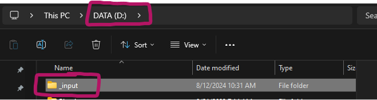
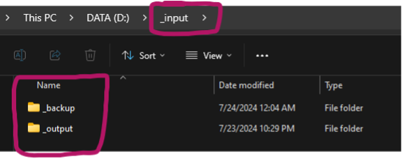
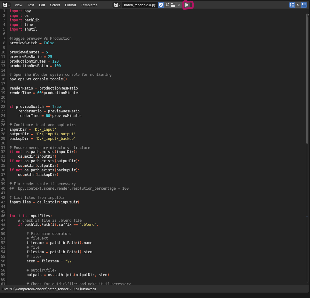

---
hide:
  - tags
tags:
  - Rendering
  - Scripting
---

# **Rendering Images**

{==

Basic process for setting the final render resolution and export settings

==}

## **Master File**
- Ensure that you are creating your scene using the provided master file as the base.
- The master file has settings baked in to allow final renders to be separated into layers.
- This is done so that the retouchers have more fine control when they are making adjustments to the images.

---

## **Final Export Resolution**

!!! note
    When setting the final render resolution, you must consider what the image will be used for.

#### **Print**
- If the image will be used in print, the resolution must be high enough such that it can support a print resolution of at least 300 DPI.
- This means you will need to be aware of the physical size of the print.
    - e.g., if you know that the final printed image will be five inches by five inches, that means to have a print resolution of at least 300 DPI, the resolution will need to be at least 1500x1500 pixels (image dimension in inches multiplied by 300).
- In practice, you want to set the resolution a bit higher than that so that the retouchers or page builders have some extra resolution to work with for adjustments. 
- In general, you want to use at least 20% higher resolution than what is strictly needed.
    - In our five-inch image example, 20% higher than 1500x1500 would be a final resolution of 1800x1800.

#### **Digital**
- If the image will be used digitally, such as a social media reel or web banner, in general it is best to simply ask the relevant team what they prefer.
- However, there are a few you can generally know ahead of time.
    - e.g., images for social media posts are generally 2160x3840, and 2500x1000 is generally sufficient for web banners.

### **Commonly Used Aspect Ratios and Resolutions**
*for print images used in catalogs*

| Size | Resolution |
| :----- | :---------- |
| Full Page | 3015 x 3915 |
| Half Page | 3015 x 1957 |
| Third Page | 3015 x 1305 |
| Quarter Page | 3015 x 979 |
| Full Spread | 6030 x 3915 |

!!! note
    - These aspect ratios and resolutions are approximations and may slightly vary

- These names (with the exception of Full Page and Spread) are not associated with an exact set of dimensions.
    - e.g., two shots labeled “third page” may be slightly different from each other when being formatted on the page.

!!! note
    - The resolution may need to be increased from what is listed in the table

- The table is meant to show the minimum resolution each shot should be in order to achieve a print resolution of 300 DPI.
- As such, while you are welcome to use a resolution ***larger*** than what is listed in the table, you should ***never go lower*** than what is listed.
- For print images not used in catalogs or that are otherwise not one of the above-mentioned sizes, ask the lead designer on the project how big the images will be, then use the 300 DPI rule to determine the pixel resolution.

---

## **Batch Rendering and Exporting**
- When rendering at higher resolutions, render times become increasingly long, making it impractical to render multiple sets of images during the workday.
- For this reason, we use a script which automates the rendering process by automatically rendering all of the blend files in a certain folder, and run the script overnight. 
    - The file with the script is provided for you. 
- To ensure the script works correctly, you will need to create a few folders on your computer for the script to read from and write to.
- First, create a folder in your D: drive named ***_input***.

<figure markdown="span">
  { width="600" }
  <figcaption>_input folder</figcaption>
</figure>

- Within that folder create two subfolders, one named ***_output*** and one named ***_backup***.

<figure markdown="span">
  { width="600" }
  <figcaption>_output and _backup folders</figcaption>
</figure>

- Blender files that are ready to be rendered will be placed in the ***_input*** folder.
- Final rendered images will be exported to the ***_output*** folder and placed in a folder with the same name as the blend file.
- The blend file then gets moved to the ***_backup*** folder once the image has completed rendering.
- Once you have placed the required files into the input folder, you will need to open the blend file with the script and run the script by clicking the play icon at the top of the window.

<figure markdown="span">
  { width="600" }
  <figcaption>Batch Render Python Script</figcaption>
</figure>

- For the script to continue running, simply lock your computer (you can use the shortcut ++windows+l++ to quickly lock it) and it will continue running in the background.

!!! warning
    When you are running the script overnight, you cannot put your computer to sleep or power it off. 

!!! note
    - For efficiency, you do not need to wait to have an entire section worth of files ready to be rendered to do the batch render.
    - It is best to simply do whichever files are ready at the end of each day, this way the retouchers are not waiting on files.

---

## **What To Do With Final Rendered Images**
- Once you have the final rendered images, you need to make them available to the retouchers.
- The easiest way to do this it to create a subfolder in the project folder located in the marketing file share server.
- For the sake of organization, it is best to have a folder structure that closely follows the project. 
    - e.g., if the project is a catalog, you should have folders for each large section, and then subfolders for each subsection, with the final images placed in the appropriate subfolders.
- At this point you can message the designated retoucher for the project and let them know that the images are ready.

---

## [**Render Settings**](../BlenderOverview/Render_Settings.html)
- Output, Format, Sampling, and Color Management (From [***Blender Overview***](../BlenderOverview/index.md))

---
