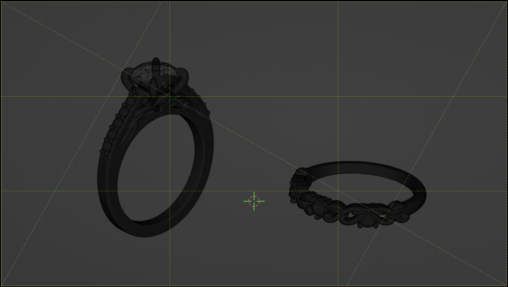
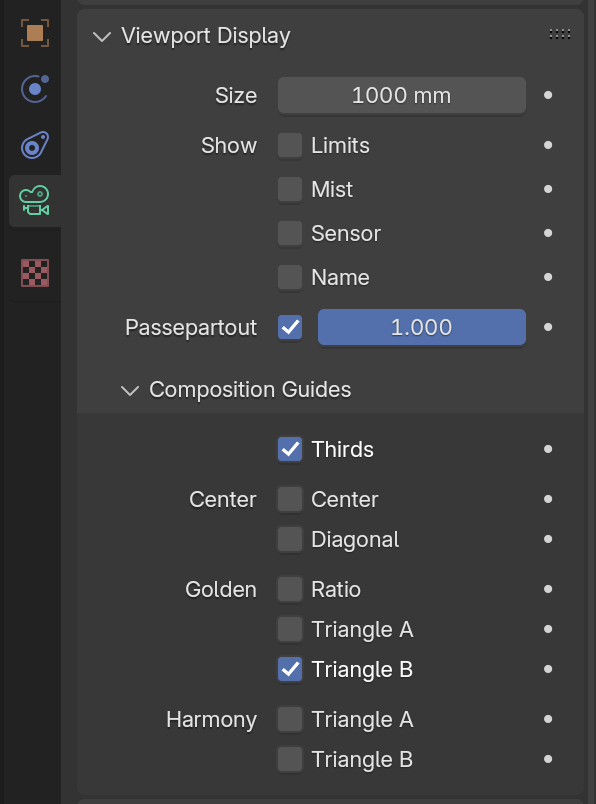
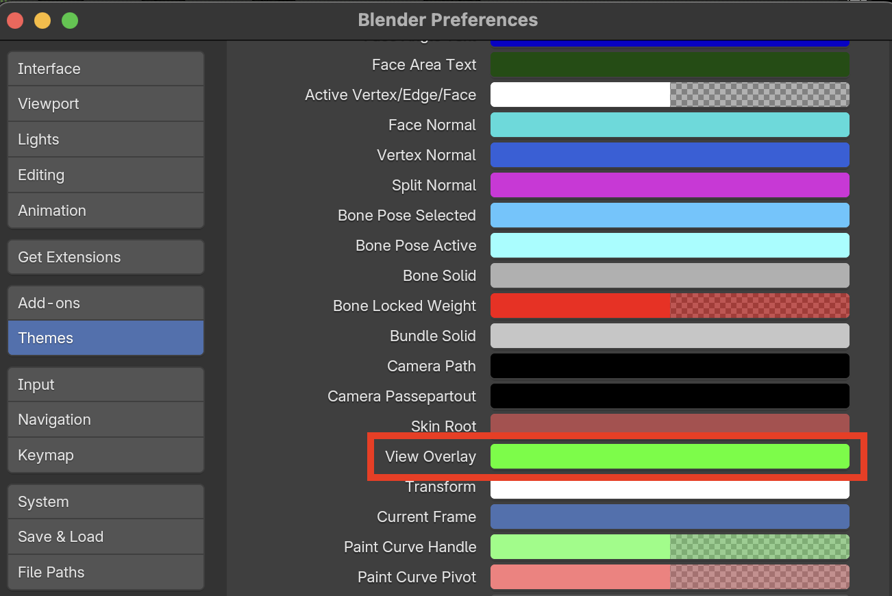
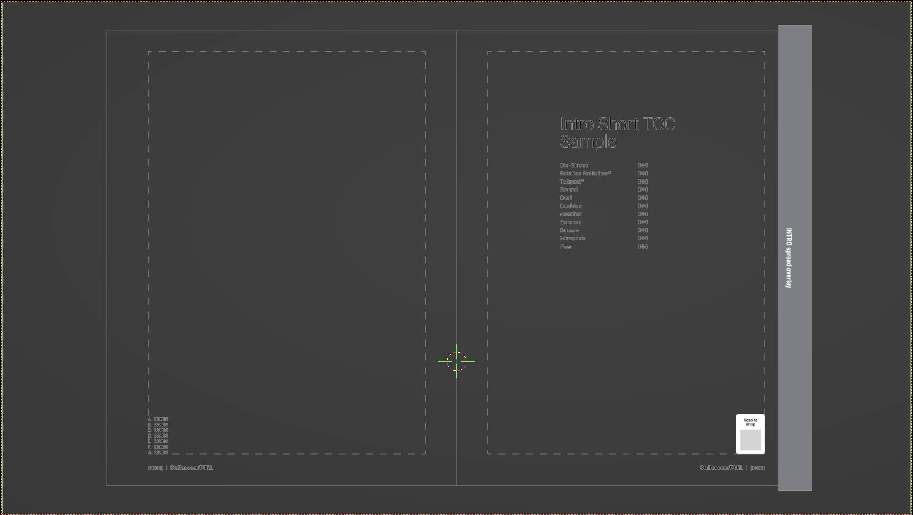
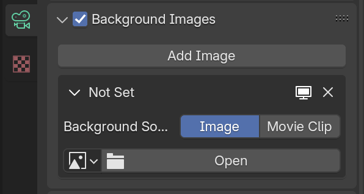

---
hide:
  - tags
tags:
  - Lighting
  - Rendering
  - Compositing
---

# **Scene Composition**

{==

Composition techniques, and placing objects in the scene

==}

## **Placing Objects**

1. Append product models to scene
- Move all product objects to a single collection ( ++m++ ) named ***PRODUCT_MODELS***

!!! tip "Tips"

    - Experiment with different angles, but make sure the jewelry is the main focal point in the frame
    
    - Leave some negative space around the jewelry to prevent a cluttered look

#### **Rapid Placement in Camera View**

1. Select product object
- ++shift+right-button++ click to Move 3D Cursor to desired location
- ++shift+s++ (3D Cursor Options) > ***Selection to Cursor***
    - Or *Object > Snap >* ***Selection to Cursor***
- Adjust as needed
    - ++r++ then ++z++ to rotate object in Z axis

#### **Randomly distribute products as a starting point**

1. From top view, position objects as desired for camera angle
    - Use ***Drop It*** addon to randomize placement (optional)
        - Random: Rotation: ~45
        - Random: Location: ~200 mm
    - Adjust any objects to ensure they are on necessary props/ground plane
- From side view, move all objects *ABOVE* any props, unless they should remain on ground plane
- Use ***Drop It*** addon to align each object to geometry directly below it
    - This accounts for different heights/elevations of any props

!!! DIVIDER ""

## **Composition Techniques**

#### **Rule of Thirds**
- Place the most important part of the jewelry (subject) or other points of interest close to one of the four intersecting points.
- If the image has two main elements, make one element take up a third of the frame and the other take up two-thirds.
- Can add interest to minimal scenes with a clear focal point.

#### **Golden Ratio** (Golden Spiral)
- Use the Golden Spiral to Emphasize Movement
- Can be used in combination with the Rule of Thirds

#### **Golden Triangle**
- Similar to the Rule of Thirds, but the frame is divided differently.
- The main subject should be placed at the intersection of the triangles.

#### **Subject Placement**
- Use leading lines to draw attention to the subject.

#### **Visual Weight** / **Balance**
- The stronger an element’s visual weight, the more it draws in the eye.

!!! DIVIDER ""

## **Composition Guides**

<figure markdown="span">
  { width="600" }
  <figcaption>Composition Overlays in 3D Camera View</figcaption>
</figure>

<figure markdown="span">
  { width="256" }
</figure>

1. Select ***Camera***
- **Object Data Properties**
- Enable preferred overlay

!!! note
    Color of Viewport Overlays can be changed in Edit > Preferences

<figure markdown="span">
  { width="480" }
</figure>

!!! DIVIDER ""

## **Catalog Template Overlays**

<figure markdown="span">
  { width="600" }
  <figcaption>Catalog Template Overlay in 3D Camera View</figcaption>
</figure>

<figure markdown="span">
  { width="320" }
</figure>

1. Select ***Camera***
- **Object Data Properties**
- Enable preferred overlay
- **Background Images**
- Click ***Open*** (or ***Add Image*** if there isn't already one there)

!!! DIVIDER ""

## **Tips**

!!! note ""
    Some of these will be more relevant than others, depending on the project.

**Keep Things Simple**

- Don't make the frame too busy or more complicated it needs to be

**Use Depth of Field**

*to bring attention to details of the jewelry and blur the background*

- Deeper DOF for full product shots
- Shallow DOF for detail shots

**Detail Shots**

- Set up cameras to get details of all sides for each piece

!!! DIVIDER ""

## [**Cameras**](../BlenderOverview/Cameras.html)
- Main Settings and Positioning (From [***Blender Overview***](../BlenderOverview/index.md))

---
